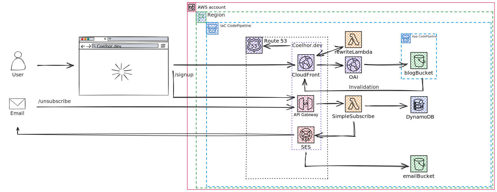

# `Coelhor.dev:` Iac

This is the IaC repo for my personal blog, here is the architecture of what is implemented by now.

## Pre-requisites

* `node` and `yarn`
* aws access - `aws sts get-caller-identity`
* [`aws-vault`](https://github.com/99designs/aws-vault/) - recommended

## Useful commands for CDK

* `yarn add …`        - add 3rd party packages from npmjs (see <https://constructs.dev/>)
* `yarn build`        - compile typescript to js
* `yarn test`         - perform the jest unit tests
* `yarn test:fix`     - update the jest test snapshot
* `yarn lint`         - lint the code
* `yarn lint:fix`     - try to fix the lint errors
* `yarn prettier`     - check for code formating compliance
* `yarn prettier:fix` - fix code formatting issues
* `yarn diff`         - compare deployed stack with current state
* `yarn synth`        - emits the synthesized CloudFormation template
* `yarn deploy …`     - deploy this stack to your default AWS account/region
